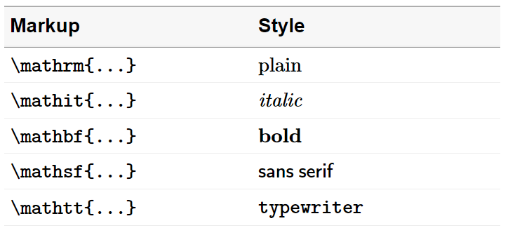

# Format text



  

Columns of text in a data table will generally not be rendered in the
same typeface as produced by
[`format_numbers()`](https://graphdr.github.io/formatdown/reference/format_numbers.md).
The
[`format_text()`](https://graphdr.github.io/formatdown/reference/format_text.md)
function provides an approach to assigning a matching typeface to such
columns.

  

*Packages.*   If you are writing your own script to follow along, we use
the following packages in this vignette. Data frame operations are
performed with data.table syntax. Some users may wish to translate the
examples to use base R or dplyr syntax.

``` r

library("formatdown")
library("data.table")
library("knitr")
```

## Markup

We format values as inline math expressions delimited by `$ ... $` or
the optional `\( ... \)`. Inside the math delimiters, the text is
formatted using math-text macros such as `\mathrm`, `\mathit`, etc.

For example, the text “Hello world!” is marked up as follows, where the
space between words is preserved by a horizontal space macro (`\>`),

        $\mathrm{Hello\>world!}$

and is rendered in an R markdown document as:
\$\small\mathrm{Hello\\world!}\$. To *program* the markup, however, we
enclose the markup in quote marks as a character string, that is,

        "$\\mathrm{Hello\\>world!}$"

where extra backslashes are necessary to “escape” the backslashes in
`\mathrm` and `\>`. When the optional font size argument is assigned,
formatdown adds a LaTeX-style sizing macro such as `\small` or `\large`,
for example,

        "$\\small\\mathrm{Hello\\>world!}$", 

where again the markup includes an extra backslash.

## `format_text()`

Converts a character vector (or a vector coercible to character class)
to math-text of the form,

        "$\\math**{txt}$" 

where `txt` is the text to be formatted and `\\math**` is a font face
macro such as `\\mathrm`, `\\mathit`, etc.

  

*Usage.*  

``` r

format_text(x,
            face = "plain",
            ...,
            size = formatdown_options("size"),
            delim = formatdown_options("delim"),
            whitespace = formatdown_options("whitespace"))
```

- Arguments before the dots do not have to be named if argument order is
  maintained.
- Arguments after the dots (`...`) must be named.
- The arguments assigned via
  [`formatdown_options()`](https://graphdr.github.io/formatdown/reference/formatdown_options.md)
  can be reset by the user locally in a function call or globally using
  [`formatdown_options()`](https://graphdr.github.io/formatdown/reference/formatdown_options.md).

  

*Examples.*   These examples are shown with default arguments. Arguments
are explored more fully starting with the next section.

``` r

# 1. One string
x <- "Alum 6061"
format_text(x)
#> [1] "$\\mathrm{Alum\\ 6061}$"

# 2. String vector
y <- c("Alum 6061", "Carbon steel", "Ni-Cr-Fe alloy")
format_text(y)
#> [1] "$\\mathrm{Alum\\ 6061}$"      "$\\mathrm{Carbon\\ steel}$"  
#> [3] "$\\mathrm{Ni-Cr-Fe\\ alloy}$"
```

Examples 1 and 2 (in inline code chunks) render as,

1.  \$\small \mathrm{Alum\\ 6061}\$
2.  \$\small \mathrm{Alum\\ 6061}\$, \$\small \mathrm{Carbon\\ steel}\$,
    \$\small \mathrm{Ni-Cr-Fe\\ alloy}\$

## Input coercible to character

Illustrating that variables of different classes are coerced to
character if possible. Starting with character class,

``` r

# 3. Character class
x <- c("abc", "def", NA_character_)
format_text(x)
#> [1] "$\\mathrm{abc}$" "$\\mathrm{def}$" "$\\mathrm{NA}$"
```

Example 3 renders as:   \$\small \mathrm{abc}\$, \$\small
\mathrm{def}\$, \$\small \mathrm{NA}\$.

``` r

# 4. Numeric class
x <- c(10, 3E-5, 4.56E+10)
format_text(x)
#> [1] "$\\mathrm{10}$"       "$\\mathrm{3e-05}$"    "$\\mathrm{4.56e+10}$"
```

Example 4 renders as:   \$\small \mathrm{10}\$, \$\small
\mathrm{3e-05}\$, \$\small \mathrm{4.56e+10}\$.

``` r

# 5. Logical class
x <- TRUE
format_text(x)
#> [1] "$\\mathrm{TRUE}$"
```

Example 5 renders as:   \$\small \mathrm{TRUE}\$.

``` r

# 6. Complex class
x <- 2 + 3i
format_text(x)
#> [1] "$\\mathrm{2+3i}$"
```

Example 6 renders as:   \$\small \mathrm{2+3i}\$.

``` r

# 7. Date class
x <- Sys.Date()
format_text(x)
#> [1] "$\\mathrm{2026-04-27}$"
```

Example 7 renders as:   \$\small \mathrm{2026-04-27}\$.

``` r

# 8 Factor class
x <- as.factor(c("low", "med", "high"))
format_text(x)
#> [1] "$\\mathrm{low}$"  "$\\mathrm{med}$"  "$\\mathrm{high}$"
```

Example 8 renders as:   \$\small \mathrm{low}\$, \$\small
\mathrm{med}\$, \$\small \mathrm{high}\$.

``` r

# 9. NULL class
x <- NULL
format_text(x)
#> character(0)
```

Example 9 renders as a zero-length character (no visible output
rendered).

## Typeface

Format the same column of text using each of the five possible `face`
arguments for comparison.

``` r

# 10. Compare available typefaces
x <- c("One day", "at a", "time.")
plain <- format_text(x, face = "plain", size = "small")
italic <- format_text(x, face = "italic", size = "small")
bold <- format_text(x, face = "bold", size = "small")
sans <- format_text(x, face = "sans", size = "small")
mono <- format_text(x, face = "mono", size = "small")
DT <- data.table(plain, italic, bold, sans, mono)
knitr::kable(DT, align = "l", caption = "Example 10.")
```

| plain | italic | bold | sans | mono |
|:---|:---|:---|:---|:---|
| \$\small \mathrm{One\\ day}\$ | \$\small \mathit{One\\ day}\$ | \$\small \mathbf{One\\ day}\$ | \$\small \mathsf{One\\ day}\$ | \$\small \mathtt{One\\ day}\$ |
| \$\small \mathrm{at\\ a}\$ | \$\small \mathit{at\\ a}\$ | \$\small \mathbf{at\\ a}\$ | \$\small \mathsf{at\\ a}\$ | \$\small \mathtt{at\\ a}\$ |
| \$\small \mathrm{time.}\$ | \$\small \mathit{time.}\$ | \$\small \mathbf{time.}\$ | \$\small \mathsf{time.}\$ | \$\small \mathtt{time.}\$ |

Example 10. {.table}

One may use the LaTeX-style macro instead of the shorthand argument
option. For example,

``` r

# 11. Two equivalent values for argument
hello_text <- "Hello world!"
p <- format_text(hello_text, face = "plain")
q <- format_text(hello_text, face = "\\mathrm")

# Demonstrate equivalence
all.equal(p, q)
#> [1] TRUE
```

Example 11 renders as:

- From *p*: \$\small \mathrm{Hello\\ world!}\$
- From *q*: \$\small \mathrm{Hello\\ world!}\$

## Special characters in math mode

The argument of
[`format_text()`](https://graphdr.github.io/formatdown/reference/format_text.md)
is evaluated within a math-markup. Thus any math syntax in your text,
such as an underscore “\_” or caret “^”, are rendered in math mode, not
verbatim. For example, the underscore creates a subscript and the caret
creates a superscript,

``` r

# 12. Special characters NOT escaped
format_text("R_e")
#> [1] "$\\mathrm{R_e}$"
format_text("m^3")
#> [1] "$\\mathrm{m^3}$"
```

Example 12 renders as:

- \$\small \mathrm{R_e}\$
- \$\small \mathrm{m^3}\$

If we wanted to retain the underscore or caret as characters, we can try
to escape the special character or use the LaTeX verbatim function,

``` r

# 13. Special characters escaped
format_text("R\\_e")
#> [1] "$\\mathrm{R\\_e}$"
format_text("m\\verb+^+3")
#> [1] "$\\mathrm{m\\verb+^+3}$"
```

Example 13 renders as:

- \$\small \mathrm{R\\e}\$
- \$\small \mathrm{m\verb+^+3}\$

## Options

Arguments assigned using
[`formatdown_options()`](https://graphdr.github.io/formatdown/reference/formatdown_options.md)
are described in the [Global
settings](https://graphdr.github.io/formatdown/articles/global_settings.md)
article.
