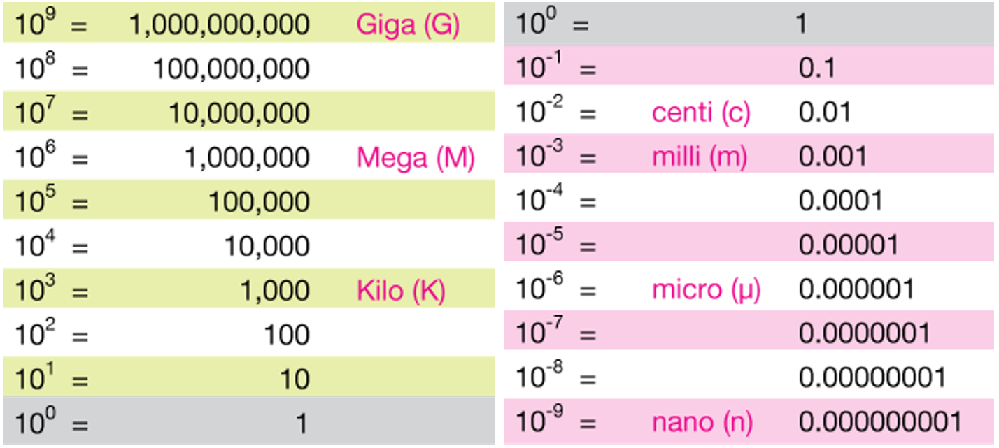

```{r setup, include = FALSE}
knitr::opts_chunk$set(
  collapse = TRUE,
  comment = "#>"
)

library("formatdown")

options(
  datatable.print.nrows = 15,
  datatable.print.topn = 3,
  datatable.print.class = TRUE
)
```

{width=70%}    
<small>Chart by Jeff Cruzan is licensed under CC BY-NC-SA 3.0</small>

<br>

The notation we use to represent large and small numbers depends on the context of our communications. In a computer script, for example, we might encode Avogadro's number as `6.0221*10^23`. A computer printout of this number would typically use E-notation, as in `6.0221E+23`.

In professional technical communications, however, computer syntax should be avoided---the asterisk (`*`) and carat (`^`) in `6.0221*10^23` communicate   *instructions to a computer*, not *syntactical mathematics*. And while scientific E-notation (`6.0221E+23`) has currency in some discourse communities, the general convention in technical communications is to format large and small numbers using powers-of-ten notation of the form, 

$$
a \times 10^n, 
$$

The $\times$ multiplication symbol, often avoided in other contexts, is conventional syntax in powers-of-ten notation. Also, the notation has two forms in general use: *scientific* and *engineering* (Chase 2021, 63–67).

- *Scientific.* &nbsp; $n$ is an integer and $a \in Re: 1\leq{|a|}<10$. For example, `r format_power(6.0221E+23, 4, format = "sci")`

- *Engineering.* &nbsp; $n$ is a multiple of 3 and $a \in Re: 1\leq{|a|}<1000$. For example, `r format_power(6.0221E+23, 4)`

*Exceptions.* &nbsp; When exponents are in the neighborhood of zero, for example, $n \in \{-1, 0, 1, 2\}$, decimal notation may be preferred to power of ten notation. Decimal values such as 0.1234, 1.234, 12.34, and 123.4 might be printed as-is. The range of exponents to include in this set is discretionary. 

*Notes on syntax.* &nbsp; We have to distinguish between computer syntax, math syntax, and markup syntax. 

- Anyone who has written a line of code involving multiplication is familiar with the asterisk as the multiplication operator, e.g., `x = a * b` or `y = a * (b + c)`. In written mathematics, however, these expressions are written without multiplication symbols, that is, $x=ab$ and $y=a(b+c)$. Moreover, mathematically the asterisk has a completely different meaning---it represents the *convolution* operation between two functions, as in $\left(f * g \right)(t)$. 

- The carat symbol (`^`), to the best of my knowledge, is a programming operator only; mathematically it has no meaning. 

- In our markup language, `\times` is the product symbol and `^` indicates a superscript or exponent. 


## Markup

In R Markdown and Quarto Markdown, we use an inline equation markup delimited by `$ ... $` to create a math expression in the output document (`\( ... \)` is also an option). For example, the markup for Avogadro's number is given by, 

        $6.0221 \times 10^{23}$

which yields $6.0221 \times 10^{23}$ in the document. To *program* the markup, however, we enclose the markup as a character string, that is, 

        "$6.0221 \\times 10^{23}$"

which requires the backward slash `\` to be "escaped", hence the product symbol is `\\times`. This is the form of the output produced by `format_power()`. 


## `format_power()`

Given a number, a numerical vector, or a numerical column from a data frame, `format_power()` converts the numbers to character strings of the form, 

        "$a \\times 10^{n}$" 
 
where `a` is the coefficient and `n` is the exponent. The user can specify the number of significant digits and scientific or engineering format. Unless otherwise specified, numbers with exponents in the neighborhood of zero are excluded from power of ten notation and are converted to character strings of the form, 

        "$a$" 

where `a` is the number in decimal notation to the specified number of significant digits.
 
*Arguments.*

- **x** &nbsp; Numerical vector to be formatted. Can be a scalar, a vector, or a column from a data frame. 

- **digits** &nbsp; Positive nonzero integer to specify the number of significant digits. Default is 4. 

- **format** &nbsp; Possible values are "engr" (engineering notation) and "sci" (scientific notation). Default is "engr". 

- **omit_power** &nbsp; Numeric vector of length two (or NULL). Determines the range of exponents between which power-of-ten notation is excluded. Default is `c(-1, 2)`.

- **set_power** &nbsp; Integer assigned as the fixed power-of-ten, overriding scientific or engineering formatting. Default NULL. 

- **delim** &nbsp; Character vector of length one or two defining the math markup delimiters. Possible values include `"$"` or `"\\("`, both of which create appropriate left and right delimiters. Custom delimiters can be assigned if required by one's TeX processor. 

If you are writing your own script to follow along, we use these packages in this vignette:

```{r}
library("formatdown")
library("data.table")
library("knitr")
```

*Equivalent usage.*  &nbsp;  The first two arguments do not have to be named if the argument order is maintained. 

```{r}
# Numerical value
avogadro <- 6.0221E+23

# Arguments named
(x <- format_power(x = avogadro, digits = 4))

# Arguments unnamed
y <- format_power(avogadro, 4)

# Implicit use of default argument
z <- format_power(avogadro)

# Demonstrate equivalence
all.equal(x, y)
all.equal(x, z)
```


## Scalar

Use with inline R code.  

```{r}
format_power(avogadro)
```

which, in an `.Rmd` or `.qmd` document, is rendered as `r format_power(avogadro)`. 


## Vector 

```{r}
x <- c(
  1.2222e-6, 2.3333e-5, 3.4444e-4, 4.1111e-3, 5.2222e-2, 6.3333e-1,
  7.4444e+0, 8.1111e+1, 9.2222e+2, 1.3333e+3, 2.4444e+4, 3.1111e+5, 4.2222e+6
)
format_power(x)
```

is rendered as `r format_power(x)[1:4]`, etc.  


## Significant digits

Argument does not have to be named. 

```{r}
format_power(x[1], 3)
format_power(x[1], 4)
```

are rendered as 

- `r format_power(x[1], 3)`
- `r format_power(x[1], 4)`


## Format

`format` argument default value is "engr". If included, argument must be named. 

```{r}
format_power(x[3])
format_power(x[3], format = "sci")
```

are rendered as 

- `r format_power(x[3])`
- `r format_power(x[3], format = "sci")`

To compare the effects across many orders of magnitude, we format the example vector twice, placing the results side by side in a data frame for comparison, rendered using `knitr::kable()`, 

```{r}
# Compare two formats
DT <- data.table(
  scientific  = format_power(x, 3, format = "sci"),
  engineering = format_power(x, 3)
)
knitr::kable(DT, align = "r", col.names = c("scientific notation", "engineering notation"))
```

The values displayed without powers-of-ten notation are in the range set by the `omit_power` argument, described in the next section. 


## Omit power notation

`omit_power` argument, if included, must be named. 

Suppose, for example, we want the value 0.0678 to be rendered without powers-of-ten notation. The exponent for this number in scientific notation is $-2$, as in `r format_power(0.0678, format = "sci")`. If this exponent is within the range set by `omit_power`, the number is rendered without power-of-ten notation (overriding the `format` argument). 

```{r}
format_power(0.0678, 3, format = "sci", omit_power = c(-2, 2))
format_power(0.0678, 3, format = "sci", omit_power = c(-1, 2))
```

are rendered as 

- `r format_power(0.0678, 3, format = "sci", omit_power = c(-2, 2))`
- `r format_power(0.0678, 3, format = "sci", omit_power = c(-1, 2))`

At the upper limit, 

```{r}
format_power(6789, 3, format = "sci", omit_power = c(-1, 2))
format_power(6789, 3, format = "sci", omit_power = c(-1, 3))
```


are rendered as

- `r format_power(6789, 3, format = "sci", omit_power = c(-1, 2))`    
- `r format_power(6789, 3, format = "sci", omit_power = c(-1, 3))` 


`omit_power = NULL` removes the exceptions and formats all numbers in  power-of-ten notation.  

```{r}
# Omit no values from power-of-ten notation
DT <- data.table(
  scientific  = format_power(x, 3, format = "sci", omit_power = NULL),
  engineering = format_power(x, 3, omit_power = NULL)
)
knitr::kable(DT, align = "r", col.names = c("scientific notation", "engineering notation"))
```

Suppose you wish to omit one specific power of ten only, for example, let `omit_power = c(-5, -5)`. 

```{r}
x <- c(3.2e-7, 4.5e-6, 4.5e-5, 6.7e-4, 3, 37800)
format_power(x, 3, format = "sci", omit_power = c(-5, -5))
format_power(x, 3, format = "engr", omit_power = c(-5, -5))
```

All the values except `4.5e-5` are formatted as powers of ten. 


## Set power notation

`set_power` argument, if included, must be named. 

When values in a table column span a few orders of magnitude, an audience is often better served by setting the notation to a constant power of ten. In the example below, we show the tabulated values of the viscosity of water as a function of temperature (from the `water` data set included with `formatdown`). 

```{r}
# Copy to avoid by-reference changes
DT <- copy(water)

# Convert temperature from K to C
DT <- DT[, .(temp = round(temp - 273.15), visc)]

# Create two columns to compare
DT[, ver1 := format_power(visc, 3)]
DT[, ver2 := format_power(visc, 3, set_power = -3)]
```

The first two columns are unformatted. The third column, in engineering format, includes exponents of $-3$ and $-6$. In the last column, we set the exponents to $-3$ throughout. 

```{r}
knitr::kable(DT, align = "r", col.names = c(
  "Temperature [C]", "Viscosity [Pa s]", "engineering notation", "with fixed exponent"
))
```

In the next example, we have density as a function of altitude with additional columns of density values formatted three ways. 

```{r}
DT <- copy(atmos)
DT <- DT[, .(alt = alt / 1000, dens)]
DT[, ver1 := format_power(dens, 3)]
DT[, ver2 := format_power(dens, 3, set_power = -3)]
DT[, ver3 := format_power(dens, 3, set_power = -3, omit_power = NULL)]

kable(DT, align = "r", col.names = c(
  "Altitude [km]",
  "Density [kg/m$^3$]",
  "engr notation",
  "set power",
  "all power"
))
```

- **engr notation** column is in engineering notation with the first two values in decimal notation (no powers of ten)
- **set power** column uses the same power of ten for all but the first two decimal values 
- **all power** column uses the same power of ten throughout (no decimal values) 


## Delimiters

`delim` argument, if included, must be named. 

```{r}
# Equivalent usage
w <- format_power(x[1])
y <- format_power(x[1], delim = "$")
z <- format_power(x[1], delim = c("$", "$"))

all.equal(w, y)
all.equal(w, z)
```

all of which render as 

- `r format_power(x[1])`

I encountered one instance in which the `$ ... $` delimiters did not produce the desired output---using `kableExtra::kbl()` to create a table in a `.qmd` output document. Switching the delimiters to `\\( ... \\)` fixed the problem, per the recommendation of the MathJax consortium  (Cervone, 2018). 

```{r}
format_power(x[1], delim = "\\(")
format_power(x[1], delim = c("\\(", "\\)"))
```

are both rendered as 

- `r format_power(x[1], delim = "\\(")`


## Data frame

Using `air_meas`, a data frame included with `formatdown` that contains columns of class Date, character, factor, numeric, and integer.

```{r}
# Included with formatdown
air_meas

# Render in document
knitr::kable(air_meas, align = "r")
```

Treating a column as a vector, 

```{r}
# Copy to avoid "by reference" changes to air_meas
DT <- copy(air_meas)

# Format as a vector
format_power(DT$pres, digits = 4)
```

is rendered as `r format_power(DT$pres, digits = 4)`. 

Treating a column within a data frame, 

```{r}
# Copy to avoid "by reference" changes to air_meas
DT <- copy(air_meas)

# Format one column, retain all columns
DT$pres <- format_power(DT$pres, digits = 4)
DT[]

# Render in document
knitr::kable(DT, align = "r")
```

Using `lapply()` to select and treat multiple columns from a data frame, 

```{r}
# Copy to avoid "by reference" changes to air_meas
DT <- copy(air_meas)

# Identify columns to format
cols_we_want <- c("temp", "pres", "dens")

# Select and format.
DT <- DT[, lapply(.SD, function(x) format_power(x, 4)), .SDcols = cols_we_want]
DT[]

# Render in document
knitr::kable(DT, align = "r")
```

Repeat, but retain all columns,  

```{r}
# Copy to avoid "by reference" changes to air_meas
DT <- copy(air_meas)

# Identify columns to format
cols_we_want <- c("temp", "pres", "dens")

# Format selected columns, retain all columns
DT <- DT[, (cols_we_want) := lapply(.SD, function(x) format_power(x, 4)), .SDcols = cols_we_want]

# Treat the gas constant with 3 digits
DT$sp_gas <- format_power(DT$sp_gas, digits = 3)
DT[]

# Render in document
knitr::kable(DT, align = "r")
```


## `knitr::kable()` options

I use some `knitr::kable()` arguments to change the header and add a caption. 


```{r}
# Ideal gas constant can be dropped from table, placed in footnote
DT$sp_gas <- NULL
names(DT)

# Render in document
knitr::kable(DT,
  align = "r",
  caption = "Table 1. Multiple readings for calculating air density",
  col.names = c(
    "Date",
    "Trial",
    "Humidity",
    "Temperature [K]",
    "Pressure [Pa]",
    "Density [kg/m$^3$]"
  )
)
```
Note: Ideal gas constant is `r format_power(round(mean(air_meas$sp_gas), 0), digits = 3)` J kg$^{-1}$K$^{-1}$. 


## References

Davide Cervone (2018) MathJax: TeX and LaTeX math delimiters,   https://docs.mathjax.org/en/v2.7-latest/tex.html#tex-and-latex-math-delimiters. 

Morgan Chase (2021) *Technical Mathematics,*  https://openoregon.pressbooks.pub/techmath/chapter/module-11-scientific-notation/.

