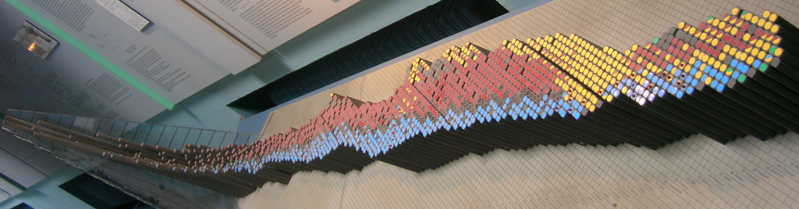

```{r setup}
#| include: false
knitr::opts_chunk$set(collapse = TRUE, comment = "#>")

library(formatdown)
library(data.table)
library(knitr)

options(
  datatable.print.nrows = 15,
  datatable.print.topn = 5,
  datatable.print.class = TRUE
)
```

{width=100%}    
<small>*Curve of Binding Energy* by J. Brew is licensed under <a href=" https://creativecommons.org/licenses/by-sa/2.0/">CC BY-SA 2.0</a></small>

<br>

In this vignette, I discuss the `format_nucl()` function for converting isotopes from _hyphenated_ notation to _nuclear_ notation. 

## Types of notation

In *hyphenated* notation, chemical elements are expressed,   

$$
\mathrm{E}{-}\mathrm{A}, 
$$

where *E* is the element symbol and *A* is its mass number, e.g., __H-1__, __H-2__, __He-3__, __He-4__, etc. 

In *nuclear* notation, the element symbol has a preceding superscript for the mass number and (optionally) a preceding subscript for the atomic number *Z*, 

$$
\mathrm{^{A}E}\ \ \mathrm{or}\ \mathrm{^{A}_{Z}E}
$$

For example, carbon 12 (atomic number 6) and uranium 238 (atomic number 92) are typeset with and without atomic numbers as shown below. The latter form, without *Z*, is the default in formatdown. 

```{r}
#| echo: false

hyphenated <- c(
  "$\\mathrm{C}$--$\\mathrm{12}$",
  "$\\mathrm{Fe}$--$\\mathrm{54}$",
  "$\\mathrm{U}$--$\\mathrm{238}$"
)
x <- c("C-12", "Fe-54", "U-238")
nuclear <- format_nucl(x)
with_Z <- format_nucl(x, Z = TRUE)
DT <- data.table(hyphenated, with_Z, nuclear)
setnames(DT,
  old = c("with_Z", "nuclear"),
  new = c("nuclear (with Z)", "nuclear (omit Z)")
)
knitr::kable(DT, align = "ccc")
```

*Packages.* &nbsp; If you are writing your own script to follow along, we use the following packages in this vignette. Data frame operations are performed with data.table syntax. Some users may wish to translate the examples to use  base R or dplyr syntax.  

```{r}
#| echo: true
#| eval: false

library("formatdown")
library("data.table")
library("knitr")
```

## Markup {#markup}

We format isotopes as inline math expressions delimited by `$ ... $` or the optional `$ ... $`. For example, carbon 12 is marked up as 

        $\mathrm{^{12}C}$,

where the `\mathrm{}` macro creates serif, non-italic text and the carat `^{}` creates the superscript for the mass number. Rendering this expression in an Rmd script as a *LaTeX-style inline equation* yields: $\mathrm{^{\small\ 12}C}$.

To *program* the markup, however, we enclose it in quote marks as a character string, that is, 

        "$\\mathrm{^{12}C}$", 

which requires us to "escape" the backslash in `\mathrm` by adding extra backslashes. Rendering this expression in an Rmd script as an *inline R code chunk* yields the same result: `r "$\\mathrm{^{12}C}$"`. 


## `format_nucl()` {#format_nucl}

Denoting *E* as the element symbol (H, He, Li, Be, ...) and *A* as the mass number of its isotope,  `format_nucl()` converts a string from the hyphenated text form, 

        "E-A" 

to a character string in the markup form, 

        "$\\mathrm{^{A}E}$", 

If the option for including the atomic number *Z* is used, the markup form includes the atomic number as a subscript using the underscore macro `_{}`, 

        "$\\mathrm{^{A}_{Z}E}$".

<br>


*Usage.* &nbsp; 

```r
format_nucl(x,
            face  = "plain",
            ...,
            Z     = formatdown_options("Z"),
            warn = formatdown_options("warn"),
            delim = formatdown_options("delim")) 
```

- Arguments before the dots do not have to be named if argument order is maintained. Arguments after the dots (`...`) must be named. 
- The arguments assigned via `formatdown_options()` can be reset by the user locally in a function call or globally using `formatdown_options()`. 
- Returns a vector
 

<br>


*Examples.* &nbsp; Scalar values are typically rendered using inline code chunks in an Rmd script. 

```{r}
# 1. Carbon-12
x <- "C-12"
format_nucl(x)

# 2. Uranium-238
y <- "U-238"
format_nucl(y)
```

Examples 1 and 2 (in inline code chunks) render as,

1. `r format_nucl("C-12")` is the most abundant isotope of carbon. 

2. The most common isotope of naturally-occurring uranium is `r format_nucl("U-238")`. 

<br>

## Including the atomic numbers

To include the atomic number (automatically obtained from a built-in data set), we can set the optional *Z* argument to TRUE.

<br>

*Examples.* &nbsp; 

```{r}
# 3. Carbon-12
x <- "C-12"
format_nucl(x, Z = TRUE)

# 4. Uranium-238
y <- "U-238"
format_nucl(y, Z = TRUE)
```

Examples 3 and 4 (in inline code chunks) render as,

3. `r format_nucl("C-12", Z = TRUE)` is the most abundant isotope of carbon. 

4. The most common isotope of naturally-occurring uranium is `r format_nucl("U-238", Z = TRUE)`. 

<br>


The *Z* argument can also be set globally using `formatdown_options()`, saving the effort of using the *Z* argument in every function call.  

```{r}
formatdown_options(Z = TRUE)

# 5. Carbon-12
format_nucl(x)

# 6. Uranium-238
format_nucl(y)
```

Examples 5 and 6 (in inline code chunks) render as,

5. `r format_nucl("C-12")` is the most abundant isotope of carbon. 

6. The most common isotope of naturally-occurring uranium is `r format_nucl("U-238")`. 

<br>

To reset the default option, 

```{r}
# reset the Z option only
formatdown_options(Z = FALSE)
```


## Typeface

Format the same column of text using each of the five possible `face` arguments for comparison. 

```{r}
# 7. Compare available typefaces
x <- c("He-4", "C-12", "Pb-204", "U-238")
plain <- format_nucl(x, face = "plain", Z = TRUE)
italic <- format_nucl(x, face = "italic", Z = TRUE)
bold <- format_nucl(x, face = "bold", Z = TRUE)
sans <- format_nucl(x, face = "sans", Z = TRUE)
mono <- format_nucl(x, face = "mono", Z = TRUE)
DT <- data.table(plain, italic, bold, sans, mono)
knitr::kable(DT, align = "l", caption = "Example 7.")
```


## Element data set

The package includes a data set of the `r length(unique(element_set$atomic_number))` chemical elements with columns for the element name, symbol, atomic number, and mass number. Because elements may have more than one isotope with distinct mass numbers, we list each isotope in its own row, resulting in a data frame with `r nrow(element_set)` rows.

```{r}
element_set
```

View the help page for the data set by typing 

```r
    library("formatdown")  
    ? element_set  
```

*Examples.* &nbsp; For example, the three isotopes of hydrogen are expressed, 

```{r}
# 8. Hydrogen isotopes
x <- c("H-1", "H-2", "H-3")
format_nucl(x, Z = TRUE)
```

Example 8 renders as: `r format_nucl(x, Z = TRUE)`


<br>


__Warning of input errors.__ &nbsp; The data set of isotopes is also used to warn of the following input errors: 

- hyphenated input symbol fails to match a standard element symbol
- hyphenated mass number fails to match a known isotope

*Examples.* &nbsp; 

Here, the first entry has an incorrect element symbol and the second has an incorrect mass number.  

```{r}
# 9. Input errors
x <- c("Carbon-12", "C-40", "C-12")
format_nucl(x)
```

Example 9 renders as `r format_nucl(x)`

If we use the atomic number argument, the letter *Z* is placed in the subscript. 

```{r}
# 10. Symbol for atomic number
format_nucl(x, Z = TRUE)
```

Example 10 renders as `r format_nucl(x, Z = TRUE)`

The third entry of the output vector is correctly formatted. The "Z" subscript in the other two entries is a hint (in addition to the warning) that the hyphenated input contains errors. 

<br>

__Notating a general form.__ &nbsp; That an unrecognized input in hyphenated form is still formatted allows us to create a nuclear notation is general form. In such a case, we can turn off the warning using the `warn` argument. 

*Examples.* &nbsp; 

```{r}
# 11. General nuclear form
x <- c("E-A")
format_nucl(x, warn = FALSE)
```

Example 11 renders as: `r format_nucl(x, warn = FALSE)`

As noted earlier, the usual `Z` argument in this case places a *Z* in the subscript position. 

```{r}
# 12. General nuclear form with atomic number symbol
x <- c("E-A")
format_nucl(x, Z = TRUE, warn = FALSE)
```

Example 12 renders as: `r format_nucl(x, Z = TRUE, warn = FALSE)`

Some authors prefer using *X* for the general element symbol, 

```{r}
# 13. Alternate general form.
x <- c("X-A")
format_nucl(x, Z = TRUE, warn = FALSE)
```

Example 13 renders as: `r format_nucl(x, Z = TRUE, warn = FALSE)`


## Inputs

*Scalars.* &nbsp; Generally used with inline R code. For example, the following R markdown sentence, which includes some inline R code,

````{verbatim}
    The most common isotope of Germanium is `r format_nucl("Ge-74")` with a
    naturally occurring frequency of 36% though `r format_nucl("Ge-72")` is
    a close second at 28%.
````

renders as: 

> The most common isotope of Germanium is `r format_nucl("Ge-74")` with a naturally occurring frequency of 36% though `r format_nucl("Ge-72")` is a close second at 28%. 


<br>

*Vector.* &nbsp; A vector of isotopes in hyphenated form (or a data frame column) is marked up as follows, 

*Examples.* &nbsp; 

```{r}
# 14. Sample vector
x <- c("H-1", "H-2", "He-3", "He-4", "Li-6", "Li-7", "Be-9")
format_nucl(x)
```

In a table, the output can be rendered as,   

```{r}
DT <- data.table(x, format_nucl(x))
knitr::kable(DT,
  align = "c",
  col.names = c("Hyphenated form", "Nuclear notation"),
  caption = "Example 14."
)
```

<br>

Adding atomic numbers yields,  

```{r}
# 15. Table with Z
DT <- data.table(x, format_nucl(x, Z = TRUE))
knitr::kable(DT,
  align = "c",
  col.names = c("Hyphenated form", "Nuclear notation"),
  caption = "Example 15."
)
```

<br>


## Options

Arguments assigned using `formatdown_options()` are described in the [Global settings](global_settings.html) article. 
