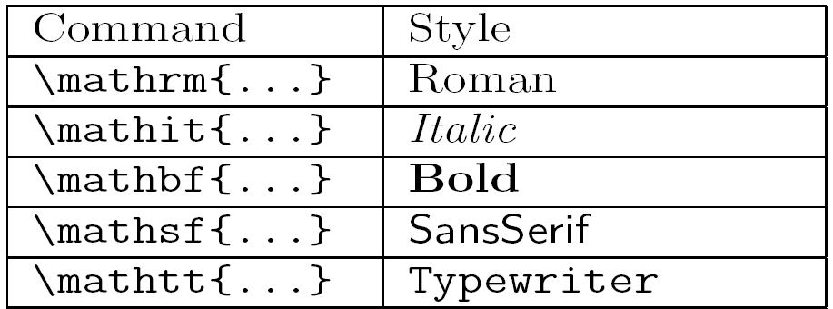

```{r setup, include = FALSE}
knitr::opts_chunk$set(
  collapse = TRUE,
  comment = "#>"
)

library("formatdown")

options(
  datatable.print.nrows = 15,
  datatable.print.topn = 3,
  datatable.print.class = TRUE
)
```

{width=70%}    
<small>LaTeX math formatting text table by Alessio Damato is licensed under CC BY-SA 3.0 <http://creativecommons.org/licenses/by-sa/3.0/> via Wikimedia Commons.</small>

<br>

Columns of text in a data table will generally not be rendered using the same typeface as numerical value formatted using `format_power()` or `format_decimal()`. The `format_text()` function provides an approach to assigning a typeface to such columns.  

## Markup

Text is delimited by `$ ... $` similar to the math markup applied by `format_power()` and `format_decimal()` with the addition of LaTeX-style  math-text commands such as `\mathrm`, `\mathit`, etc. and font size commands such as `\small` or `\normalsize` to output one of the standard typefaces for text. 

For example, the default  markup for the text "abcde" is given by

        "$\\small\\mathrm{abcde}$"

where `\\small` controls the font size. As discussed in other vignettes, the backslash in `\small` and  `\mathrm` must be "escaped" for rendering, hence the markup is given by `\\small\\mathrm`. 


## `format_text()`

Given a character string, vector, or column from a data frame, `format_text()` converts the values to character strings of the form, 

        "$\\size\\math*{a}" 
 
where `a` is the element to be formatted; `\\size` controls the font size using conventional LaTeX size commands (`\\small`, `\\normalsize`, `\\large`, etc.); and  `\\math*`⁠ determines the font face: plain type is set by `\\mathrm`; italics by `\\mathit`; bold by `\\mathbf`, sans serif by `\\mathsf`; and monospace (typewriter text) by `\\mathtt`. The string includes markup delimiters `$...$`⁠ for rendering as an inline equation in R Markdown or Quarto Markdown document.

*Arguments.*

- **x** &nbsp; Text to be formatted. Can be a scalar, a vector, or a column from a data frame. Non-characters are coerced to character class if possible. 

- **face** &nbsp; Font face. Possible values are "plain" (default), "italic", "bold", "sans", or "mono". Can also be set as a global option, for example,  `options(formatdown.font.face = "sans)`, that can be overwritten in an  individual function call. 

- **size** &nbsp; Font size. Possible values are "scriptsize", "small" (default), "normalsize", "large", or "huge". Can also be set as a global option, for example, `options(formatdown.font.size = "normalsize")`, that can be overwritten in an individual function call.

- **delim** &nbsp; Character vector of length one or two defining the math markup delimiters. Possible values include `"$"` (default) or `"\\("`, both of which create appropriate left and right delimiters. Custom delimiters can be assigned if required by one's TeX processor. 

If you are writing your own script to follow along, we use these packages in this vignette:

```{r}
library("formatdown")
library("data.table")
library("knitr")


options(formatdown.font.size = "small")
```


## Font size

Format the same column of text using each of the five possible `size` arguments for comparison. 

```{r}
x <- c("low", "med", "high")

# Compare formats
DT <- data.table(
  scriptsize = format_text(x, size = "scriptsize"),
  small      = format_text(x, size = "small"),
  normalsize = format_text(x, size = "normalsize"),
  large      = format_text(x, size = "large"),
  huge       = format_text(x, size = "huge")
)
knitr::kable(DT, align = "r")
```


## Typeface

Format the same column of text using each of the five possible `face` arguments for comparison. 

```{r}
# Compare formats
DT <- data.table(
  plain  = format_text(x, face = "plain"),
  italic = format_text(x, face = "italic"),
  bold   = format_text(x, face = "bold"),
  sans   = format_text(x, face = "sans"),
  mono   = format_text(x, face = "mono")
)
knitr::kable(DT, align = "r")
```


## Special characters in math mode

The argument of `format_text()` is evaluated within a math-markup. Thus math syntax such as an underscore "_" or carat "^" are rendered in math mode, not verbatim. For example, the underscore creates a subscript and the carat creates a superscript, 

```{r}
format_text("R_e")
format_text("m^3")
```

rendered as

- `r format_text("R_e")` 
- `r format_text("m^3")`

To retain the underscore or carat as characters, we can try to escape the special character or use the LaTeX verbatim function,  

```{r}
format_text("R\\_e")
format_text("m\\verb|^|3")
```

rendered as

- `r format_text("R\\_e")`
- `r format_text("m\\verb|^|3")`


## Tables of data

Because `format_text()` is intended for columns of text in data tables, we reproduce here a table developed in the `format_power()` vignette. 

First, we'll format the numerical columns, 

```{r}
# Copy to avoid "by reference" changes to air_meas
DT <- copy(air_meas)

# Format selected columns to 4 digits
cols_we_want <- c("temp", "pres", "dens")
DT <- DT[, (cols_we_want) := lapply(.SD, function(x) format_power(x, 4)), .SDcols = cols_we_want]

# Treat the gas constant with 3 digits
DT$sp_gas <- format_power(DT$sp_gas, digits = 3)

# View the result
DT[]

# Render in document
knitr::kable(DT,
  align = "r",
  caption = "Table 1. Numerical columns formatted; text columns unformatted.",
)
```

Next we'll format the three text columns using the default `face = "plain"` argument, resulting in text columns whose typeface matches that of the numerical columns for a consistent visual aesthetic. 
 
```{r}
# Format selected columns as text
cols_we_want <- c("date", "trial", "humid")
DT <- DT[, (cols_we_want) := lapply(.SD, function(x) format_text(x)), .SDcols = cols_we_want]

# View the result
DT[]

# Render in document
knitr::kable(DT,
  align = "r",
  caption = "Table 2. Text columns formatted to match",
)
```


## Options

The `options()` function can be used to set global values for two arguments in `format_text()`:

- `face` (default is "plain")
- `size` (default is "small")

For example,

```{r}
# Assign arguments to be used from this point forward in the script
options(
  formatdown.font.size = "large",
  formatdown.font.face = "italic"
)

# Copy to avoid "by reference" changes to air_meas
DT <- copy(air_meas)

# Format selected columns to 4 digits
cols_we_want <- c("temp", "pres", "dens")
DT <- DT[, (cols_we_want) := lapply(.SD, function(x) format_power(x, 4)), .SDcols = cols_we_want]

# Treat the gas constant with 3 digits
DT$sp_gas <- format_power(DT$sp_gas, digits = 3)

# Format selected columns as text
cols_we_want <- c("date", "trial", "humid")
DT <- DT[, (cols_we_want) := lapply(.SD, function(x) format_text(x)), .SDcols = cols_we_want]

# Render in document
knitr::kable(DT,
  align = "r",
  caption = "Table 3. Using `option()` for size size and face",
)
```

You can overwrite your global assignment using the `face` or `size` argument in any individual function call.  

- The `face` option affects arguments of `format_text()` only. 
- The `size` option affects arguments of both `format_text()` and `format_power()`. 

