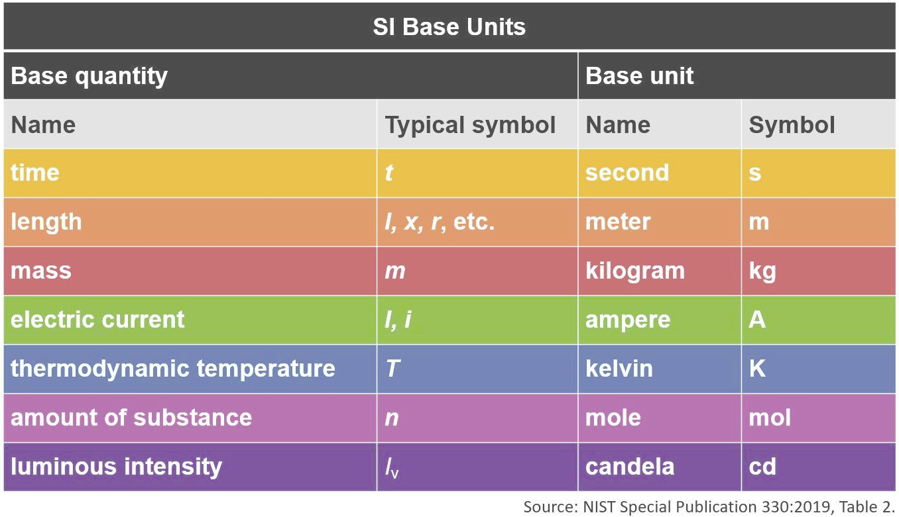

```{r setup, include = FALSE}
knitr::opts_chunk$set(
  collapse = TRUE,
  comment = "#>"
)

library("formatdown")

options(
  datatable.print.nrows = 15,
  datatable.print.topn = 3,
  datatable.print.class = TRUE
)
```


{width=70%}    
<small>*Table of SI units* by US National Institute of Standards and Technology (NIST)</small>

<br>

We can avoid the need for powers-of-ten notation by adjusting the measurement units assigned to a numerical vector. For example, we can convert `r format_power(101300)` Pa to 1013 hPa or 101.3 kPa. 

We use the `units` package for this feature. The `formatdown::format_units()` function is a wrapper for `units::as_units()`, allowing us to assign basic physical units to a numerical vector and performing unit conversions that transform the numerical value to match the new measurements units. 

As a brief illustration, consider a pressure measurement of 101,300 Pa. 

```{r}
# Scalar value assigned a measurement unit
x <- 101300
units(x) <- "Pa"

# Original value
format_units(x, big_mark = ",")

# Convert to hPa
format_units(x, unit = "hPa")

# Convert to psi
format_units(x, digits = 3, unit = "psi")
```

These values are rendered using inline R code  in an `.Rmd` or `.qmd` output document as follows: 

- Original pressure measurement: `r format_units(x, big_mark = ",")`

- Convert measurement units: `r format_units(x, unit = "hPa")`

- Convert measurement units: `r format_units(x, digits = 3, unit = "psi")`

Like other `formatdown` functions, `format_units()` operates on a numerical vector to output a character vector for rendering in an R Markdown or Quarto Markdown document. Unlike `format_power()` however, `format_units()` does not apply inline math delimiters. 

## `format_units()`

Given a number, a numerical vector, or a numerical column from a data frame, `format_units()` converts the numbers to character strings of the form, 

        "a [u]" 
 
where `a` is the number and `u` is the measurement unit. The user can specify the number of significant digits.
 
*Arguments.*

- **x** &nbsp; Vector to be formatted, of class numeric or class units. Can be a scalar, a vector, or a column from a data frame.

- **digits** &nbsp; Numeric scalar, a positive integer. Applied as the digits argument of `base::format()`. Enough decimal places are included such that the smallest magnitude value has this many significant digits.

- **unit** &nbsp; Character scalar, units label compatible with `units`  package.

- **unit_form** &nbsp; Character scalar. Possible values are "standard" (default) and "implicit" (implicit exponent form). In standard form, units are related with arithmetic symbols for multiplication, division, and powers, e.g., `"kg/m^3"` or `"W/(m*K)"`. In implicit exponent form, symbols are separated by spaces and numbers represent exponents, e.g., `"kg m-3"` or `"W m-1 K-1"`.

- **big_mark** &nbsp; Character. Applied as the `big.mark` argument of `base::format()`. Default is `""`. If a period is selected for `big_mark`, the decimal mark is changed to a comma.

If you are writing your own script to follow along, we use these packages in this vignette:

```{r}
library(formatdown)
library(data.table)
suppressPackageStartupMessages(library(units))
library(knitr)
```


## Scalar

Assign a value and units, 

```{r}
x <- 101300
units(x) <- "Pa"
```

Use with inline R code.

```{verbatim}
`r format_units(x)`
`r format_units(x, unit = "hPa")`
```

which, in an `.Rmd` or `.qmd` document, are rendered as

- `r format_units(x)`.
- `r format_units(x, unit = "hPa")`.


## Vector

The `atmos` data set included with `formatdown` has an altitude variable `alt` in meters. The columns do not include units metadata. Column is class numeric. 

```{r}
# Variable is class numeric
x <- atmos$alt
x
class(x)
```

Assign measurement units  to match the source values and format. Results are class character. 

```{r}
x_char <- format_units(x, unit = "m")
x_char
```

If we intend to convert the units, e.g., from meters to kilometers, we have to assign the source measurement units before using `format_units()`. Results are numeric, class units. 

```{r}
# Assign units before formatting
units(x) <- "m"
x
class(x)
```

Convert units and format. The numbers change to match the unit conversion.  Results are class character. 

```{r}
# Covert units and format as character
x_char <- format_units(x, unit = "km")
x_char
```


## Digits

The `digits` argument sets the number of significant digits. Here, temperature values (K) are reported to 4 significant digits. 

```{r}
x <- sort(atmos$temp, decreasing = TRUE)
format_units(x, digits = 4, unit = "K")
```

With values in decimal form, reducing `digits` to 3 has the expected effect of rounding to the units place. 

```{r}
format_units(x, digits = 3, unit = "K")
```

However, reducing `digits` to 2 has no additional effect. To reduce the number of significant digits further, we apply `signif()` to the numerical values before formatting with `format_units()`.  

```{r}
# Values are not converted to 2 significant digits
format_units(x, digits = 2, unit = "K")

# Apply signif() before formatting
format_units(signif(x, 2), unit = "K")
```

If values span different orders of magnitude, the number of significant digits is applied to the *smallest magnitude value* and the number of decimal places in the other values is set to match. 

For example, from the `metals` data set included with `formatdown`, the elastic modulus values (Pa) are converted to (GPa) with `digits = 3`. 

```{r}
x <- sort(metals$elast_mod, decreasing = TRUE)
units(x) <- "Pa"
format_units(x, digits = 3, unit = "GPa")
```

Three digits applied to the smallest magnitude value yields "13.8 [GPa]". Larger values are then formatted to the same number of decimal places. Thus some larger values will have more than three digits, e.g., "206.8 [GPa]". 


## Data frame 

Using the `atmos` data set include with `formatdown` with various atmospheric properties as a function of height above sea level. 

```{r}
# Data set included with formatdown
DT <- copy(atmos)

# Render in document
knitr::kable(DT, align = "r")
```

Formatting one column at a time, assigning and converting units, and assigning significant digits ad-hoc. When numerical values in a column span a number of orders of magnitude, the number in the column with the smallest magnitude, e.g., pressure or density last row, is displayed with the number of significant digits specified by the `digits` argument. 

```{r}
units(DT$alt) <- "m"
DT[, alt := format_units(alt, unit = "km")]

units(DT$temp) <- "K"
DT[, temp := format_units(temp, 3, unit = "deg_C")]

units(DT$pres) <- "Pa"
DT[, pres := format_units(pres, unit = "hPa")]

units(DT$dens) <- "kg/m^3"
DT[, dens := format_units(dens, unit = "g/m^3", unit_form = "implicit")]

units(DT$sound) <- "m/s"
DT[, sound := format_units(sound, 4)]

knitr::kable(
  DT,
  align = "r",
  col.names = c("Altitude", "Temperature", "Pressure", "Density", "Speed of sound")
)
```

## US customary units

The same table can be formatted in US customary units as shown below. 

```{r}
# Data set included with formatdown
DT <- copy(atmos)

units(DT$alt) <- "m"
DT[, alt := format_units(alt, unit = "ft")]

units(DT$temp) <- "K"
DT[, temp := format_units(temp, 2, unit = "deg_F")]

units(DT$pres) <- "Pa"
DT[, pres := format_units(pres, unit = "psi")]

units(DT$dens) <- "kg/m^3"
DT[, dens := format_units(dens, unit = "lb/ft^3", unit_form = "implicit")]

units(DT$sound) <- "m/s"
DT[, sound := format_units(sound, 4, unit = "ft/s")]

knitr::kable(
  DT,
  align = "r",
  col.names = c("Altitude", "Temperature", "Pressure", "Density", "Speed of sound")
)
```

## Applying powers of ten notation

Power of ten notation can often be avoided by applying the units format, but in some cases both may be desired. For example, the column of density values in the table above span several orders of magnitude. One might wish to format these values using power of ten notation. 

Our approach is to work with the original data for this one column only and substitute the result for the "Density" column in the data frame above. 

```{r}
# Start with the original density vector
x <- atmos$dens

# Assign the original units
units(x) <- "kg/m^3"

# Display a representative value
x[5]
```

We use the `units()` function to convert to the units we want, in this case, `[lb ft-3]` (using the units package "implicit" style of notation). 

```{r}
# Convert to US Customary units
display_units <- "lb ft-3"
units(x) <- display_units

# Display the same representative value
x[5]
```

Having already assigned our units to the `display_units` variable (for later use), we convert the vector from units class to numeric class. 

```{r}
# Convert the vector to numeric values
x <- as.numeric(x)

# Display the representative value
x[5]
```

Apply `format_power()` to yield the values as character strings in power of ten notation. 

```{r}
# Apply power of ten notation using format_power()
x <- format_power(x, digits = 3, format = "sci")

# Display the representative value
x[5]
```

Append the display units to each element of the vector.  

```{r}
# Append units string to value strings
x <- paste0(x, " [", display_units, "]")

# Display the representative value
x[5]
```

Finally, substitute this vector for the column of density values constructed earlier. 

```{r}
# Substitute for column in the data frame from above
DT[, dens := x]

knitr::kable(
  DT,
  align = "r",
  col.names = c("Altitude", "Temperature", "Pressure", "Density", "Speed of sound")
)
```

